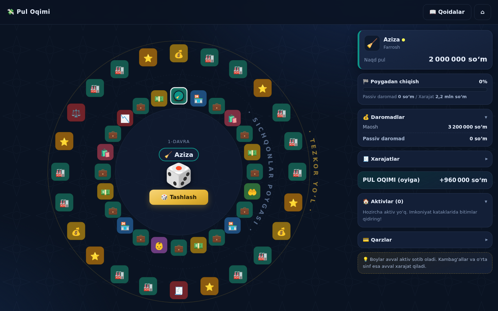

# 💸 Pul Oqimi — moliyaviy savodxonlik oʻyini

**Oʻzbekiston aholisi uchun brauzerda ishlaydigan moliyaviy savodxonlik oʻyini.**
Robert Kiyosakining mashhur «CASHFLOW» stol oʻyini gʻoyalaridan ilhomlangan mustaqil, bepul va ochiq kodli taʼlimiy loyiha — toʻliq oʻzbek tilida, Oʻzbekiston voqeligiga moslab qurilgan.

> Farroshdan millionergacha! «Sichqonlar poygasi»dan chiqing: aktivlar yigʻing, passiv
> daromadingizni xarajatlardan oshiring va «Tezkor yoʻl»da orzuingizni amalga oshiring.



## ✨ Xususiyatlar

- **18 ta real kasb** — farrosh (3,2 mln), pochtachi, taksichi, elektrik, oʻqituvchi, shifokor,
  blogger, stomatolog, dasturchi, tadbirkor (22 mln)… Maoshlar 2025–2026-yillardagi Oʻzbekiston
  moʻljallariga asoslangan (stat.uz: 2026-yil I chorakda oʻrtacha oylik ish haqi ≈ 6,8 mln soʻm).
- **110+ oʻzbekcha karta**: somsa tandiri, choyxona, nonvoyxona, issiqxona, toʻyxona, Chilonzordagi
  kvartira, Buxorodagi mehmon uyi… va albatta toʻyona, osh berish, qudalarga sarpo kabi hayotiy xarajatlar 😄
- **6 ta real UZSE aksiyasi** — Toshkent fond birjasida (uzse.uz) haqiqatda savdolanadigan
  qogʻozlar: SQBN, HMKB, KVTS, QZSM, UZMK, URTS (narxlar taxminiy, oʻyin ichida tebranadi).
- **Toʻliq oʻyin mexanikasi**: ikki doira (Sichqonlar poygasi → Tezkor yoʻl), maosh kuni, bozor,
  ehson, farzand, ishdan boʻshatish, bank krediti (oyiga 3%), ipoteka, omonat, obligatsiya,
  dividendlar, bankrotlik va 2 xil gʻalaba yoʻli (orzu yoki +600 mln/oy pul oqimi).
- **Moliyaviy hisobot paneli** — daromad/xarajat/aktiv/passiv jonli koʻrinib turadi; har navbatda
  moliyaviy savodxonlik maslahatlari.
- **1–4 oʻyinchi** bitta qurilmada (navbatma-navbat), avtomatik saqlash va davom ettirish.
- **Tez sur’at**: navbatlar avtomatik yakunlanadi, ortiqcha bosishlar yoʻq — bitta partiya
  odatda ~30–60 daqiqa (yakka oʻyin undan ham tez).
- **Animatsiyalar**: shoshqol, fishkalar harakati, karta modallar, konfetti 🎉
- Oddiy **HTML+CSS+JS** — hech qanday build, framework yoki server kerak emas. Telefonda ham ishlaydi.

## 🚀 Ishga tushirish

**1-usul (eng oson):** `index.html` faylini brauzerda oching — tamom.

**2-usul (lokal server):**
```bash
python3 -m http.server 8080
# brauzerda: http://localhost:8080
```

**3-usul (internetga chiqarish — GitHub Pages, bepul):**
repozitoriy sozlamalarida **Settings → Pages → Deploy from a branch** ni tanlang,
branch va `/ (root)` papkani koʻrsating — sayt bir daqiqada tayyor.

## 🎮 Qoidalar qisqacha

1. Kasb va orzu tanlaysiz. Har kasbning maoshi, xarajati va qiyinligi har xil
   (kichik maosh = kichik xarajat — poygadan chiqish osonroq!).
2. Shoshqol tashlab doira boʻylab yurasiz: 💼 imkoniyat (bitimlar), 🏪 bozor, 🛍️ xarajat,
   💵 maosh kuni, 🤲 ehson, 👶 farzand, 📉 ishdan boʻshatish.
3. Maqsad — **passiv daromad > xarajatlar**: shunda «Tezkor yoʻl»ga oʻtasiz.
4. Tezkor yoʻlda yirik bizneslar olib, **orzuingizni sotib olsangiz** yoki **+600 mln soʻm/oy**
   yangi pul oqimi yaratsangiz — GʻALABA! 🏆

Toʻliq qoidalar va lugʻat oʻyinning «📖 Qoidalar» boʻlimida.

## 🔧 Loyiha tuzilishi

```
index.html            — bitta sahifali ilova
css/style.css         — dizayn (qorongʻu tema, girih naqshlari)
js/util.js            — yordamchi funksiyalar (soʻm formati, RNG)
js/data/professions.js — 13 kasb (maosh/xarajat/kreditlar)
js/data/stocks.js     — UZSE aksiyalari maʼlumotlari
js/data/cards.js      — barcha kartalar (bitim/bozor/xarajat/orzu…)
js/data/tips.js       — maslahatlar va lugʻat
js/engine.js          — oʻyin mexanikasi (sof mantiq, DOMsiz)
js/board.js           — SVG taxta va animatsiyalar
js/ui.js              — panel, modallar, effektlar
js/main.js            — ekranlar, saqlash, harakatlar navbati
test/sim.js           — balans simulyatori (Node)
```

**Balansni tekshirish:** `node test/sim.js 300` — har kasb uchun yuzlab avtomatik oʻyin
oʻynab, chiqish/gʻalaba/bankrotlik statistikasi chiqaradi. Hozirgi balans: koʻpchilik kasblar
~40 oyda (oʻyin vaqtida) poygadan chiqadi; shifokor, taksichi va tadbirkor — ataylab
«qiyin rejim» (xuddi asl oʻyindagidek).

**Maʼlumotlarni yangilash:** aksiya narxlari — `js/data/stocks.js`, maoshlar —
`js/data/professions.js`, narxlar — `js/data/cards.js`. Hammasi oddiy JS obyektlar,
izohlar bilan.

## ⚠️ Muhim eslatmalar

- Bu **taʼlimiy oʻyin**, moliyaviy yoki investitsiya maslahati emas. Barcha raqamlar
  (maoshlar, narxlar, foizlar, aksiya kurslari) — 2025–2026-yillar moʻljallari asosida
  soddalashtirilgan va yaxlitlangan taxminlar.
- «CASHFLOW®» — Cashflow Technologies, Inc. (Robert Kiyosaki) savdo belgisi. Ushbu loyiha
  u bilan **hech qanday aloqada emas**: oʻyin mexanikasi gʻoyalaridan ilhomlangan boʻlsa-da,
  barcha matnlar, kartalar, dizayn va kod mustaqil yaratilgan. Loyihani tijoriy maqsadda
  ishlatishdan oldin yuridik maslahat olish tavsiya etiladi.
- Maʼlumot manbalari (moʻljal sifatida): [stat.uz](https://stat.uz) (ish haqi statistikasi),
  [uzse.uz](https://uzse.uz) (birja kotirovkalari).

## 🗺️ Yoʻl xaritasi

- [ ] Rus va kirill-oʻzbek tillari
- [ ] Onlayn koʻp oʻyinchi rejimi (doʻstlar bilan masofadan)
- [ ] iOS/Android ilovalar (Capacitor orqali — kod tayyor asos boʻladi)
- [ ] UZSE narxlarini jonli API orqali olish
- [ ] «Oʻqituvchi rejimi» — maktab va universitetlarda dars uchun
- [ ] Ovoz effektlari va musiqa
- [ ] Yutuqlar (achievements) va statistika

---

## 🇬🇧 English summary

**Pul Oqimi** (“Cash Flow” in Uzbek) is a free, open-source, browser-based financial literacy
game for Uzbekistan, inspired by the mechanics of Robert Kiyosaki's CASHFLOW board game
(independent project, not affiliated; CASHFLOW® is a trademark of Cashflow Technologies, Inc.).

Players pick one of 13 real professions with realistic 2025–2026 Uzbek salaries, escape the
rat race by building passive income from localized assets — samsa stalls, teahouses,
Tashkent apartments, greenhouses, and real Tashkent Stock Exchange (UZSE) tickers — then win
on the fast track by buying their dream or reaching +600M soʻm/month cash flow.

Pure HTML/CSS/JS, no build step: open `index.html`, or serve statically (GitHub Pages ready).
Game balance is verified by a Node simulation harness (`node test/sim.js`). All data lives in
plain, commented JS files under `js/data/` for easy updating. MIT licensed.

*Maqsad — millionlab yurtdoshlarimizning moliyaviy savodxonligini oshirish. Ulashing, hissa qoʻshing!* 🇺🇿
